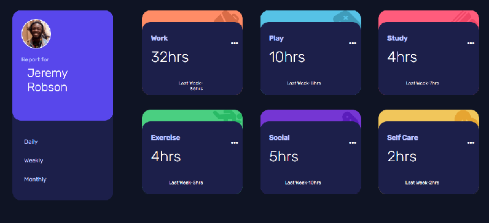
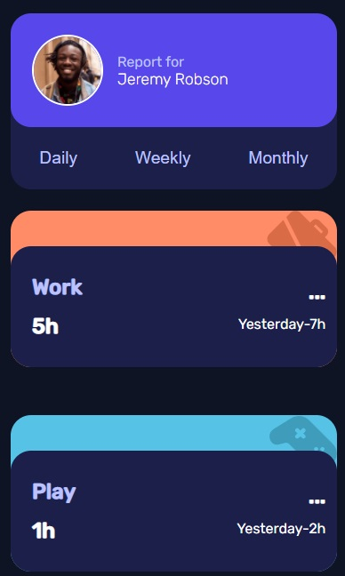

# Frontend Mentor - Time tracking dashboard solution

This is a solution to the [Time tracking dashboard challenge on Frontend Mentor](https://www.frontendmentor.io/challenges/time-tracking-dashboard-UIQ7167Jw). Frontend Mentor challenges help you improve your coding skills by building realistic projects.

## Table of contents

- [Overview](#overview)
  - [The challenge](#the-challenge)
  - [Screenshot](#screenshot)
  - [Links](#links)
- [My process](#my-process)
  - [Built with](#built-with)
  - [What I learned](#what-i-learned)
  - [Continued development](#continued-development)
  - [Useful resources](#useful-resources)
- [Author](#author)
- [Acknowledgments](#acknowledgments)

## Overview

### The challenge

Users should be able to:

- View the optimal layout for the site depending on their device's screen size
- See hover states for all interactive elements on the page
- Switch between viewing Daily, Weekly, and Monthly stats

### Screenshot

/

### Links

- Solution URL: [Gothmate's solution](https://gothmate.github.io/time-tracking-dashboard/)

## My process

### Built with

- Semantic HTML5 markup
- CSS custom properties
- Flexbox
- CSS Grid
- Mobile-first workflow
- Saas
- JavaScript

### What I learned

I used this challenge to preview my working time in each fase of the development and to learn Saas workflow.

### Continued development

I wish to advance in Sass development to simplify my code.

Learn new methods to manipulate the layout.

### Useful resources

- [usefull help from] = [@edinelsonslima](https://www.instagram.com/edinelsonslima/) and Paulo-RJ#9438 (discord user account)

## Author

- Website - [gothmate](https://gothmate.github.io)
- Frontend Mentor - [@gothmate](https://www.frontendmentor.io/profile/gothmate)
